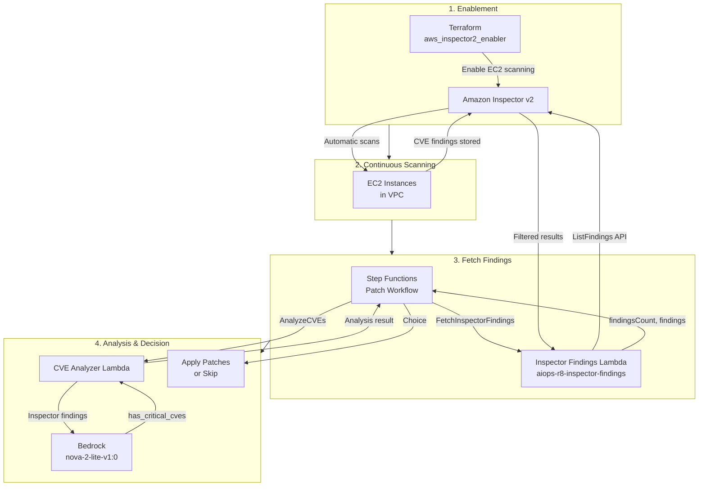
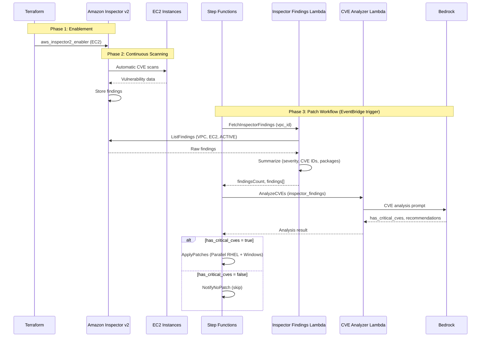

# Amazon Inspector Integration

## Overview

This project uses **Amazon Inspector v2** for CVE vulnerability scanning instead of SSM pre-patch scans. Inspector automatically scans EC2 instances for vulnerabilities; the patch workflow fetches findings and sends them to Bedrock for analysis.

## What "Discovers Workloads" Means

Amazon Inspector is a vulnerability management service that automatically discovers workloads. **"Discovers workloads"** means Inspector automatically finds and identifies the compute resources in your AWS account that it can scan—without you having to manually register or configure each one.

### What "workloads" are

Workloads are the compute resources Inspector can scan, such as:

- **EC2 instances** (Linux, Windows)
- **Container images** in Amazon ECR
- **Lambda functions**
- **ECR repositories**

### What "discover" means

Inspector uses AWS APIs and metadata to:

1. **List resources** – It queries AWS (e.g., EC2, ECR, Lambda) to see what exists in the account.
2. **Track changes** – As you add or remove instances, images, or functions, Inspector sees those changes.
3. **Associate metadata** – It links resources to things like VPCs, tags, and regions.

So "discovers" = **automatically finds and keeps track of** these resources.

### What you don't have to do

You don't need to:

- Manually register each instance or image
- Install a separate discovery agent
- Maintain a list of targets

Once Inspector is enabled for a resource type (e.g., EC2), it discovers and scans those workloads automatically.

## Why Inspector Instead of SSM Pre-Patch?

| Aspect | SSM Pre-Patch | Amazon Inspector |
|--------|---------------|------------------|
| **Scan source** | Commands run on each instance | AWS-managed scanning service |
| **Coverage** | Per-instance scripts | EC2, ECR, Lambda (this project uses EC2) |
| **Data format** | Raw command output | Structured findings (severity, CVE IDs, packages) |
| **Maintenance** | Custom SSM documents | No custom documents for scanning |
| **Consistency** | Varies by OS/script | Unified CVE database |

## Workflow Diagram

## Detailed Workflow Sequence

## How It Works

1. **Terraform** enables Inspector v2 for EC2 via `aws_inspector2_enabler`
2. **Inspector** automatically scans EC2 instances in the account
3. **Inspector Findings Lambda** fetches findings via `inspector2:ListFindings` with filters:
   - `findingStatus`: ACTIVE
   - `resourceType`: AwsEc2Instance
   - `ec2InstanceVpcId`: Project VPC ID
4. **CVE Analyzer Lambda** receives the findings and sends them to Bedrock
5. **Bedrock** (`us.amazon.nova-2-lite-v1:0`) analyzes severity (CRITICAL/HIGH vs LOW/MEDIUM) and returns `has_critical_cves`

## Inspector Findings Lambda

- **Name**: `aiops-r8-inspector-findings`
- **Input**: `vpc_id`, `rhel8_ids`, `windows_ids` (optional, for context)
- **Output**: `findingsCount`, `findings` (summary with severity, CVE IDs, affected packages), `rawFindingsCount`
- **Permissions**: `inspector2:ListFindings`, CloudWatch Logs

## Findings Summary Format

Each finding passed to Bedrock includes:

- **severity**: CRITICAL, HIGH, MEDIUM, LOW
- **cveIds**: List of CVE identifiers (e.g., CVE-2024-1234)
- **affectedPackages**: Package names
- **description**: Brief vulnerability description

## Prerequisites

- **Inspector v2 enabled** for EC2 (Terraform does this)
- **EC2 instances** must be running and in the target VPC
- **New instances** may need time (minutes to hours) before Inspector has findings

## Inspecting Findings in AWS Console

1. Open **Amazon Inspector** in the AWS Console
2. Navigate to **Findings**
3. Filter by VPC ID, resource type (EC2), and status (Active)

## API Reference

- [ListFindings - Inspector API](https://docs.aws.amazon.com/inspector/v2/APIReference/API_ListFindings.html)
- [Inspector v2 - User Guide](https://docs.aws.amazon.com/inspector/latest/user/what-is-inspector.html)
