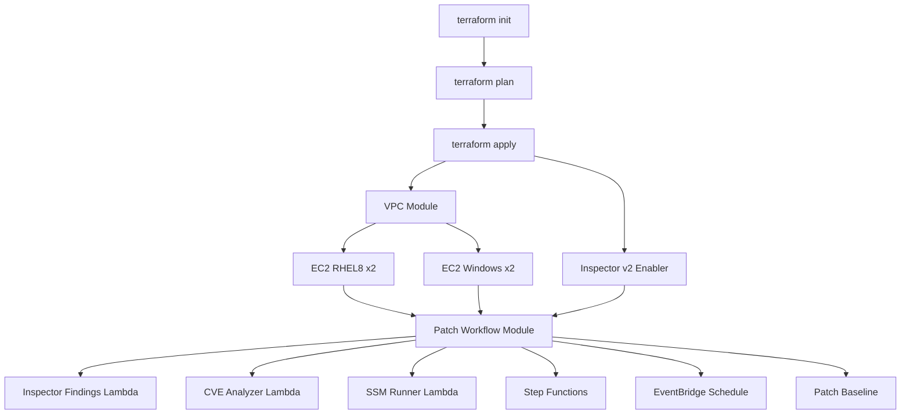

# Terraform Workflow

## Directory Structure

```
terraform/
├── main.tf              # Root module - orchestrates all components
├── variables.tf         # Input variables
├── outputs.tf           # Output values
├── locals.tf            # Local values and common tags
├── terraform.tfvars.example
└── modules/
    ├── vpc/             # VPC, subnets, NAT, security groups
    ├── ec2-rhel8/       # RHEL8 EC2 instances (x2)
    ├── ec2-windows/     # Windows EC2 instances (x2)
    └── patch-workflow/  # Inspector Findings Lambda, CVE Analyzer Lambda, SSM Runner Lambda, EventBridge, Step Functions, SSM, Bedrock
```

## Deployment Flow



## Module Dependencies

| Module | Depends On | Outputs Used By |
|--------|------------|-----------------|
| `aws_inspector2_enabler` | - | patch-workflow (implicit) |
| `vpc` | - | ec2-rhel8, ec2-windows, patch-workflow |
| `ec2-rhel8` | vpc | patch-workflow |
| `ec2-windows` | vpc | patch-workflow |
| `patch-workflow` | vpc, ec2-rhel8, ec2-windows, inspector | - |

## Key Workflow Steps

### 1. Initialize

```bash
cd terraform
terraform init
```

### 2. Configure Variables

```bash
cp terraform.tfvars.example terraform.tfvars
# Edit terraform.tfvars with your values
```

### 3. Plan

```bash
terraform plan -out=tfplan
```

### 4. Apply

```bash
terraform apply tfplan
```

### 5. Outputs

After apply, Terraform outputs:

- `rhel8_instance_ids` – RHEL8 instance IDs
- `windows_instance_ids` – Windows instance IDs
- `vpc_id` – VPC ID (used by Inspector Findings Lambda)
- `patch_workflow_state_machine_arn` – Step Functions ARN
- `patch_schedule_rule_arn` – EventBridge rule ARN

## Amazon Inspector

Terraform enables **Amazon Inspector v2** for EC2 at the account level via `aws_inspector2_enabler`. The patch-workflow module depends on Inspector being enabled so that the Inspector Findings Lambda can fetch CVE findings.

## State Management

For production, configure remote state:

```hcl
backend "s3" {
  bucket         = "your-terraform-state-bucket"
  key            = "aiops-r8/terraform.tfstate"
  region         = "us-east-1"
  encrypt        = true
  dynamodb_table = "terraform-state-lock"
}
```

## Destroy

```bash
terraform destroy
```

**Note**: Ensure no critical data remains before destroying. Reports on instances will be lost.
