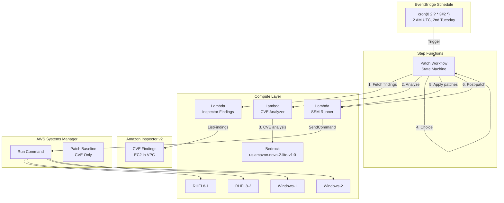
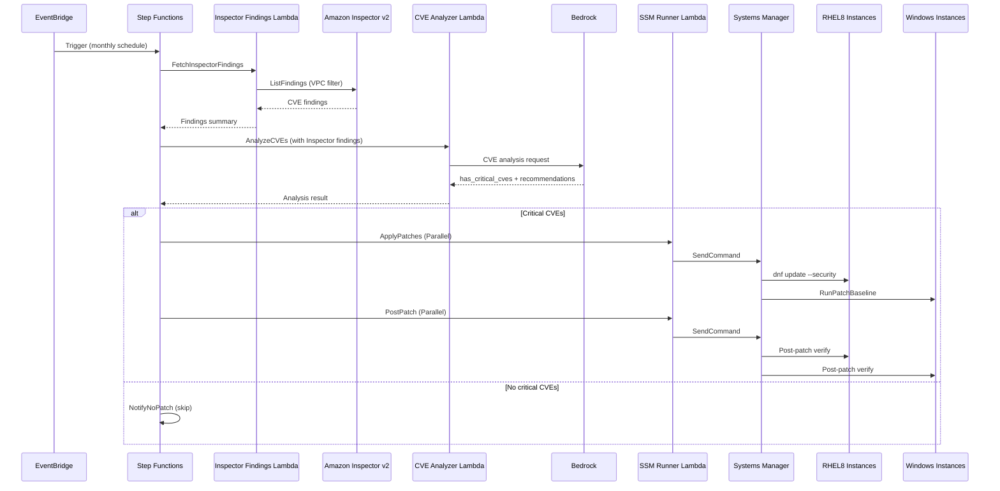
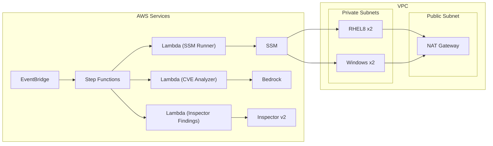
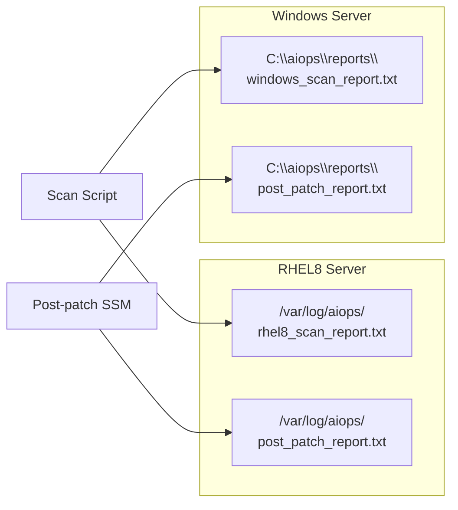

# AIOps R8 - Architecture Diagram

## High-Level Architecture (Amazon Inspector)

```mermaid
flowchart TB
    subgraph Schedule["EventBridge Schedule"]
        CRON["cron(0 2 ? * 3#2 *)<br/>2 AM UTC, 2nd Tuesday"]
    end

    subgraph Orchestration["Step Functions"]
        SF["Patch Workflow<br/>State Machine"]
    end

    subgraph Compute["Compute Layer"]
        LAMBDA_INSPECTOR["Lambda<br/>Inspector Findings"]
        LAMBDA_ANALYZER["Lambda<br/>CVE Analyzer"]
        LAMBDA_SSM["Lambda<br/>SSM Runner"]
        BEDROCK["Bedrock<br/>us.amazon.nova-2-lite-v1:0"]
        RHEL1["RHEL8-1"]
        RHEL2["RHEL8-2"]
        WIN1["Windows-1"]
        WIN2["Windows-2"]
    end

    subgraph Inspector["Amazon Inspector v2"]
        INSP["CVE Findings<br/>EC2 in VPC"]
    end

    subgraph SSM["AWS Systems Manager"]
        SSM_CMD["Run Command"]
        PATCH_BASE["Patch Baseline<br/>CVE Only"]
    end

    CRON -->|Trigger| SF
    SF -->|1. Fetch findings| LAMBDA_INSPECTOR
    LAMBDA_INSPECTOR -->|ListFindings| INSP
    SF -->|2. Analyze| LAMBDA_ANALYZER
    LAMBDA_ANALYZER -->|3. CVE analysis| BEDROCK
    SF -->|4. Choice| SF
    SF -->|5. Apply patches| LAMBDA_SSM
    LAMBDA_SSM -->|SendCommand| SSM_CMD
    SSM_CMD --> RHEL1
    SSM_CMD --> RHEL2
    SSM_CMD --> WIN1
    SSM_CMD --> WIN2
    SF -->|6. Post-patch| LAMBDA_SSM
```

## Patch Workflow Sequence (Amazon Inspector)

```mermaid
sequenceDiagram
    participant EB as EventBridge
    participant SF as Step Functions
    participant L_INSP as Inspector Findings Lambda
    participant INSP as Amazon Inspector v2
    participant L_ANALYZER as CVE Analyzer Lambda
    participant B as Bedrock
    participant L_SSM as SSM Runner Lambda
    participant SSM as Systems Manager
    participant RHEL as RHEL8 Instances
    participant WIN as Windows Instances

    EB->>SF: Trigger (monthly schedule)
    SF->>L_INSP: FetchInspectorFindings
    L_INSP->>INSP: ListFindings (VPC filter)
    INSP-->>L_INSP: CVE findings
    L_INSP-->>SF: Findings summary
    SF->>L_ANALYZER: AnalyzeCVEs (with Inspector findings)
    L_ANALYZER->>B: CVE analysis request
    B-->>L_ANALYZER: has_critical_cves + recommendations
    L_ANALYZER-->>SF: Analysis result
    alt Critical CVEs
        SF->>L_SSM: ApplyPatches (Parallel)
        L_SSM->>SSM: SendCommand
        SSM->>RHEL: dnf update --security
        SSM->>WIN: RunPatchBaseline
        SF->>L_SSM: PostPatch (Parallel)
        L_SSM->>SSM: SendCommand
        SSM->>RHEL: Post-patch verify
        SSM->>WIN: Post-patch verify
    else No critical CVEs
        SF->>SF: NotifyNoPatch (skip)
    end
```

## Infrastructure Components

```mermaid
graph LR
    subgraph VPC["VPC"]
        subgraph Private["Private Subnets"]
            RHEL["RHEL8 x2"]
            WIN["Windows x2"]
        end
        subgraph Public["Public Subnet"]
            NAT["NAT Gateway"]
        end
    end

    subgraph AWS["AWS Services"]
        LAMBDA_INSP["Lambda (Inspector Findings)"]
        LAMBDA_ANALYZER["Lambda (CVE Analyzer)"]
        LAMBDA_SSM["Lambda (SSM Runner)"]
        SF["Step Functions"]
        EB["EventBridge"]
        SSM["SSM"]
        BEDROCK["Bedrock"]
        INSP["Inspector v2"]
    end

    EB --> SF
    SF --> LAMBDA_INSP
    LAMBDA_INSP --> INSP
    SF --> LAMBDA_ANALYZER
    LAMBDA_ANALYZER --> BEDROCK
    SF --> LAMBDA_SSM
    LAMBDA_SSM --> SSM
    SSM --> RHEL
    SSM --> WIN
    RHEL --> NAT
    WIN --> NAT
```

## Report Storage Locations

```mermaid
flowchart LR
    subgraph RHEL["RHEL8 Server"]
        R1["/var/log/aiops/<br/>rhel8_scan_report.txt"]
        R2["/var/log/aiops/<br/>post_patch_report.txt"]
    end

    subgraph WIN["Windows Server"]
        W1["C:\\aiops\\reports\\<br/>windows_scan_report.txt"]
        W2["C:\\aiops\\reports\\<br/>post_patch_report.txt"]
    end

    SCAN["Scan Script"] --> R1
    SCAN --> W1
    POST["Post-patch SSM"] --> R2
    POST --> W2
```
