# AIOps R8: Presentation Diagrams & Flowcharts

Mermaid diagrams for each presentation slide. Use in Markdown viewers or export to images.

---

## Slide 1: Title & Overview – Component Stack

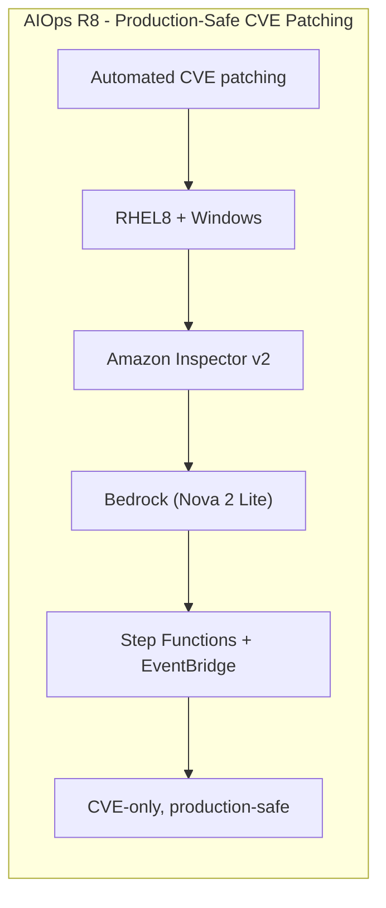

---

## Slide 2: The Problem – Pain Points

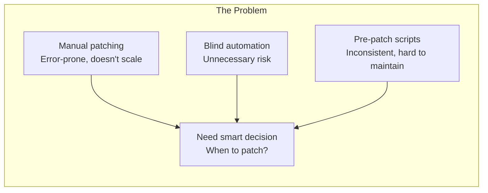

---

## Slide 3: The Solution – High-Level Flow

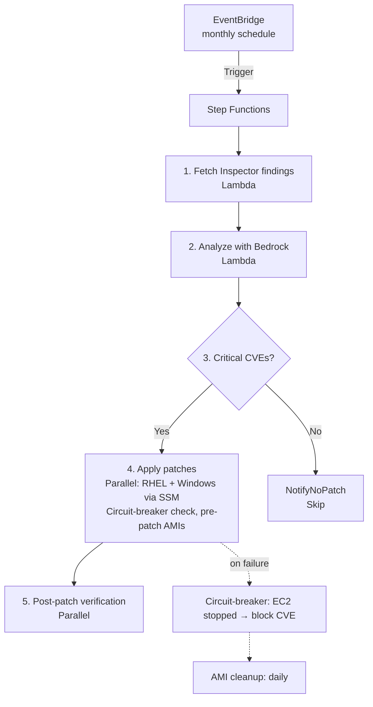

---

## Slide 4: Architecture – Key Components

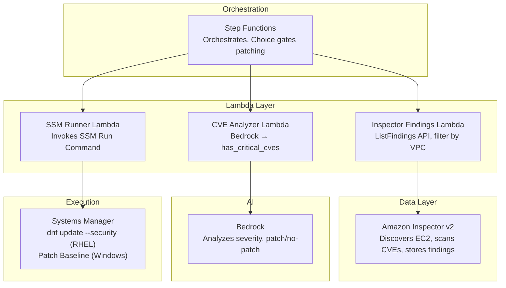

---

## Slide 5: Inspector vs SSM Pre-Patch – Comparison

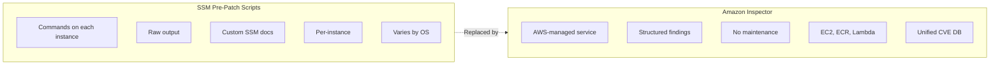

---

## Slide 6: AI in the Loop – Bedrock Decision Flow

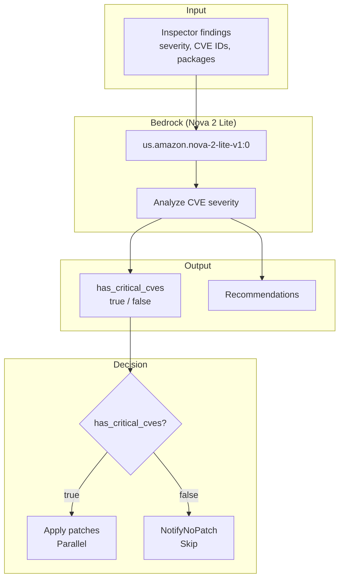

---

## Slide 7: CVE-Only Patching – Production-Safe

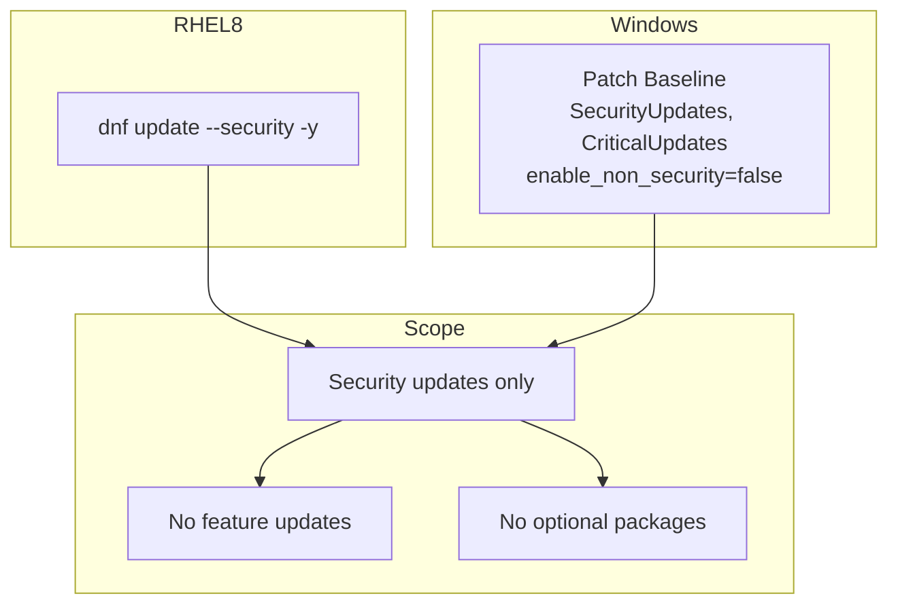

---

## Slide 8: Schedule & Triggers

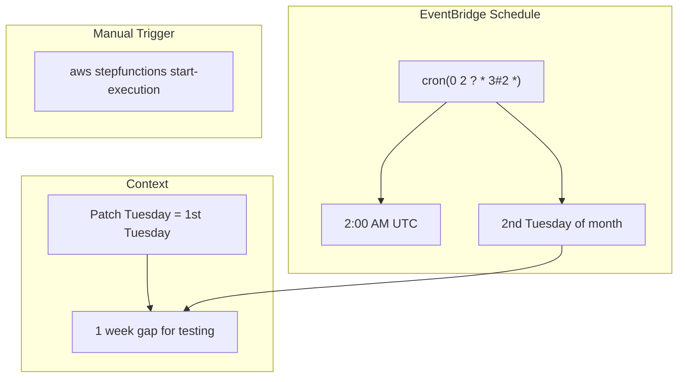

---

## Slide 9: Report Locations

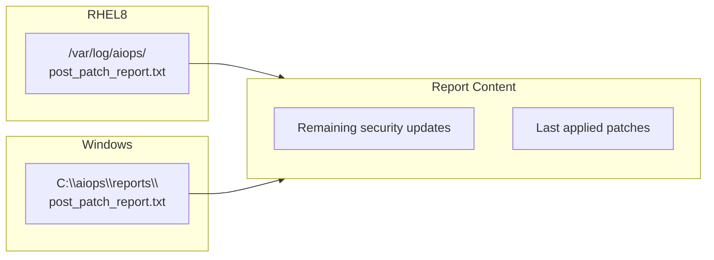

---

## Slide 10: Cost Overview

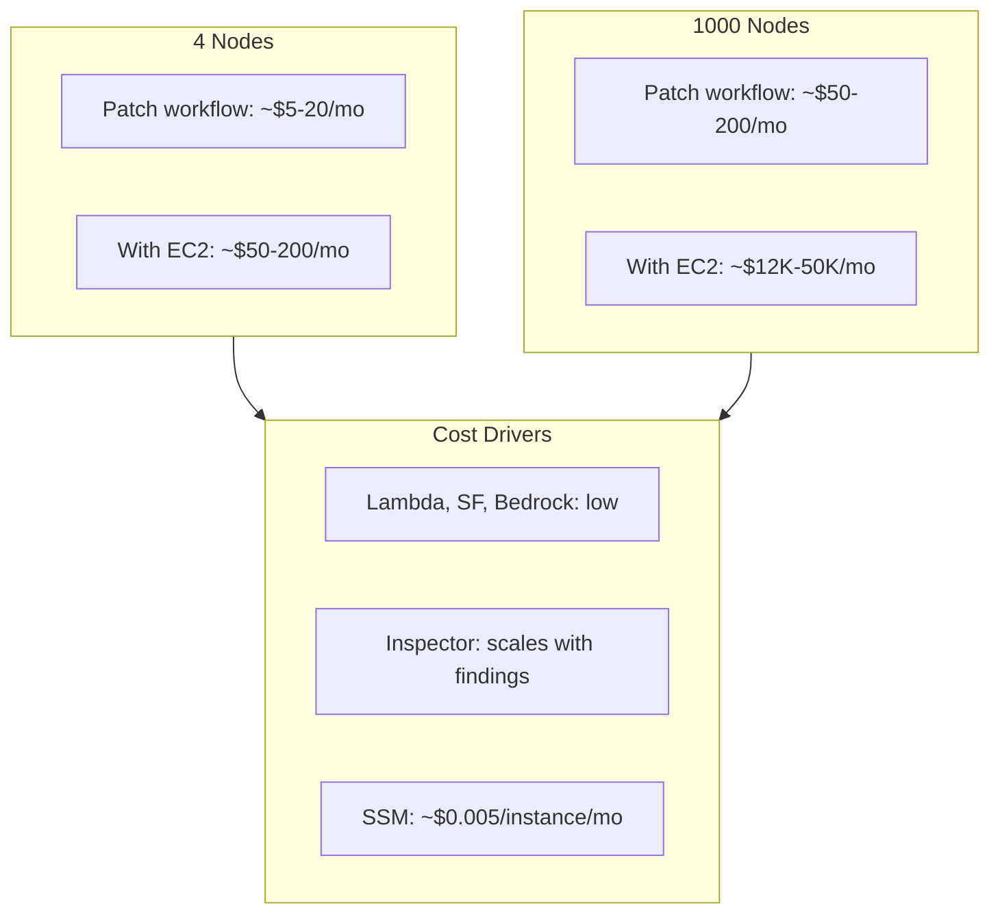

---

## Slide 11: Where Are Patch Decisions Stored?

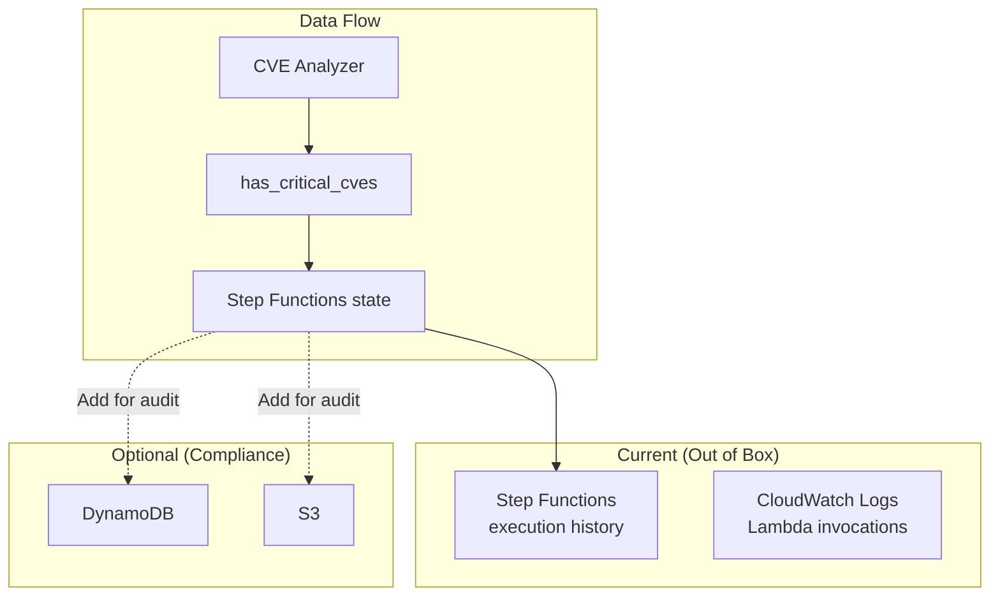

---

## Slide 12: Infrastructure as Code

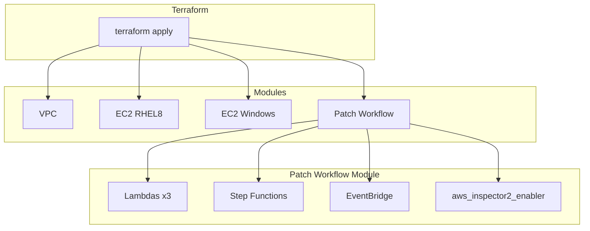

---

## Slide 13: Key Takeaways

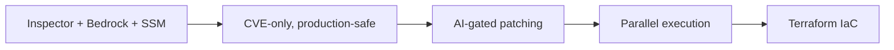

---

## Appendix: Step Functions State Machine

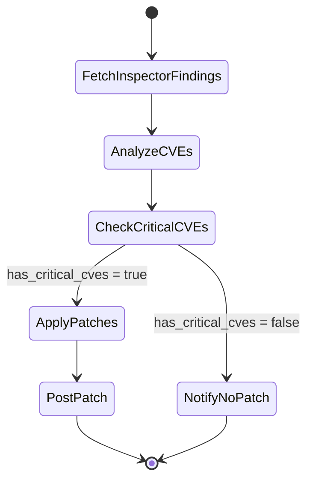

---

## Appendix: End-to-End Sequence Diagram

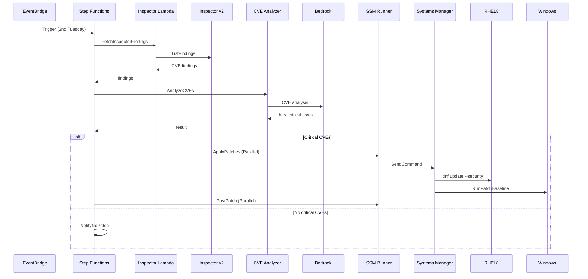
